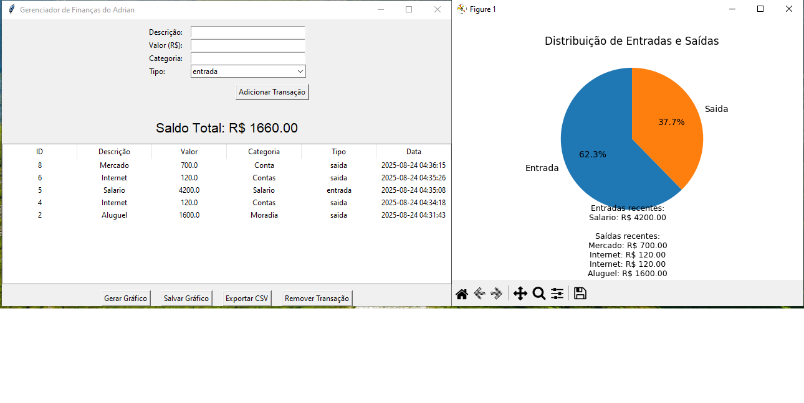
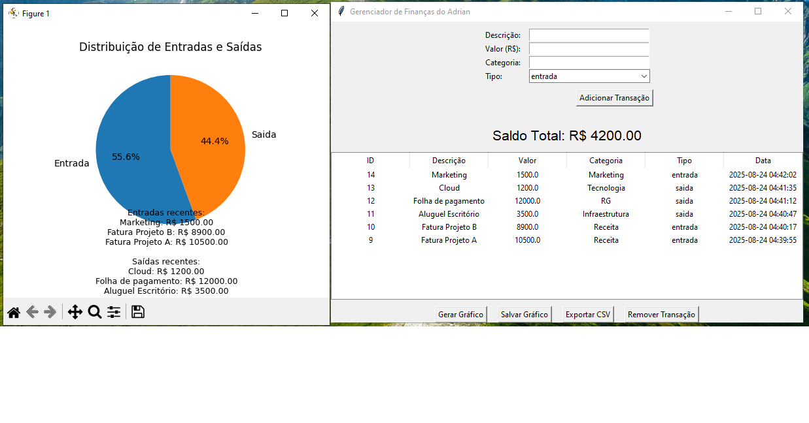

# Finance Manager (Tkinter + SQLite)

Desktop app to track **personal** and **B2B** finances with a simple GUI, a local SQLite database, and one-click chart/CSV export.  
Built with **Python**, **Tkinter**, **SQLite**, and **Matplotlib**.

---

## Features
- Add transactions with **description, value, category, type** (`entrada` / `saida`)
- Automatic **running balance** shown at the top
- Sortable **table** and **remove** action for selected rows
- **Pie chart** of totals (preview or save as PNG)
- **Export CSV** of all transactions
- Local **SQLite** DB (`financas.db`) created automatically

---

## Demos

<p align="center">
  
  
</p>

> The screenshots were produced by entering a small set of transactions in the app and using **Salvar Gráfico** and **Exportar CSV**.

---

## Requirements
- Python 3.8+
- Tkinter (bundled with Python on Windows/macOS)
- Matplotlib

Install Matplotlib (if needed):

```bash
pip install matplotlib
